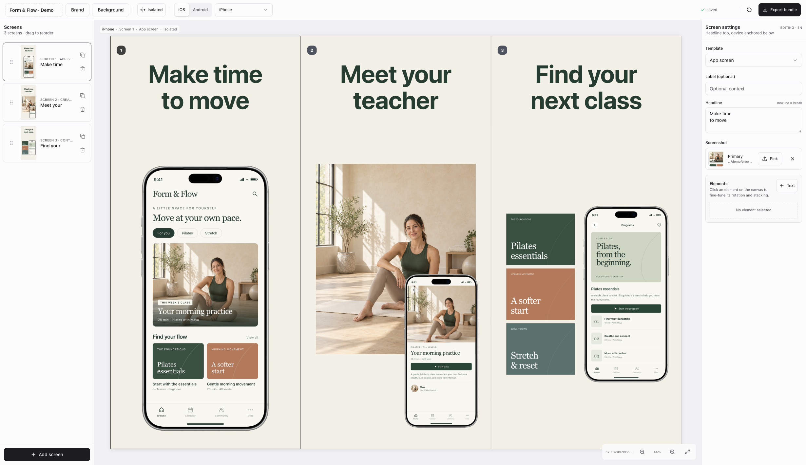

# App Store Screenshots

## New here? Let your assistant set it up

You do not need to write code. Give Claude this request:

```text
Set up this screenshot tool on my computer:
https://github.com/mweisberg21/app-store-screenshots/tree/improve-brand-defaults
Read START-HERE.md and follow its first-run guide. I am not technical.
Help me one step at a time. Open the editor, help me make my first
image, and show me how to use the tool again later.
```

**[Start here: setup and your first image](START-HERE.md)** explains the Mac and Windows workflow, what files to supply, and what to ask next. Your assistant needs local file and command access. The guide helps you get to the correct app or setting if your current chat cannot install software.

**For the assistant:** read [the skill](skills/app-store-screenshots/SKILL.md) and [the first-run guide](skills/app-store-screenshots/references/first-run.md). Complete setup, verify the editor in the user's browser, and teach the first task in plain language. Do not stop at a list of commands.

A local editor and agent skill for teams that create App Store and Google Play listing images for customer apps. Start with real app captures and the customer's brand. Use the browser editor to refine the deck and export PNGs.



Example: the App screen, Creator with app, and Content library templates. Form & Flow is a fictional demo app with generated instructor photography. Customer projects use real app captures and approved brand assets.

This fork retains Parth Jadhav's MIT license and author credit. It adds local access controls, validated saves, upload limits, and a workflow for customer work.

## Start here

- [Team guide](skills/app-store-screenshots/team-guide.md): setup, a reusable request, and customer handoff.
- [Customer brief](skills/app-store-screenshots/customer-brief.example.md): brand sources, features, assets, devices, and languages.
- [Design research](skills/app-store-screenshots/references/listing-design-research.md): six current listing references and three template types.
- [ASO playbook](skills/app-store-screenshots/references/aso-screenshot-playbook.md): audience, feature evidence, screenshot order, localization, and measured tests.
- [Uscreen capture guide](skills/app-store-screenshots/references/uscreen-mobile-features.md): member features, useful screens, and customer-specific checks.
- [Skill instructions](skills/app-store-screenshots/SKILL.md): the complete agent workflow.
- [Included Apple frames](skills/app-store-screenshots/references/apple-frames.md): original iPhone and iPad bezels, file checks, and credits.

## What the editor does

- Saves customer background, text color, headline type, and alignment through **Brand** controls.
- Adds a **Background** picker for solid colors, linear/radial gradients, and uploaded images. Preview crop, zoom, fit, tint, and text color before applying to the project or one screen. See [background controls](skills/app-store-screenshots/references/backgrounds.md).
- Provides App screen, Creator with app, and Content library templates.
- Keeps creator photos and catalog artwork separate from app captures, with saved crop and zoom controls.
- Shows real captures in included Apple iPhone and iPad bezels, or generic Android frames.
- Supports per-device decks, localized copy, ordering, and element placement.
- Starts with one empty, isolated screen per device. Connected mode is available for deliberate compositions.
- Saves the project to `app-store-screenshots.json` and stores uploads in the project.
- Checks missing text, translations, required images, Apple capture proportions, headline contrast, and measured text overflow before export.
- Exports PNG bundles using the configured device-size presets, plus a review sheet for each language.

These checks do not verify product claims, translation quality, element overlap, image crop, or store approval. Inspect the PNGs before delivery.

## Design direction

Use the **App screen** structure as the base: one large, centered headline, one real app capture, and a customer brand surface. Repeat the layout when it helps the reader. Decorative effects are optional. Explicit alignment choices in existing projects remain available.

Choose **Creator with app** when a teacher or creator is central to the service. Choose **Content library** for two to four approved catalog images beside the app view. Use crop controls to keep important content visible. The neutral starter is a work surface, not a finished customer design.

## Install

Use Node.js 22 or newer and a coding agent with local file and command access, such as Codex or Claude Code.

The packaged frames and English preview are on `improve-brand-defaults` in [draft PR 2](https://github.com/mweisberg21/app-store-screenshots/pull/2). Use the branch-specific command below while the PR is open. A default-branch install still gets the older version.

```bash
npx skills add https://github.com/mweisberg21/app-store-screenshots/tree/improve-brand-defaults/skills/app-store-screenshots -g
```

Choose the supported agent in the installer. The skill includes its design instructions and template; no additional design skill is required.

Manual shared install:

```bash
git clone --branch improve-brand-defaults --single-branch https://github.com/mweisberg21/app-store-screenshots
mkdir -p ~/.agents/skills
cp -R app-store-screenshots/skills/app-store-screenshots ~/.agents/skills/
```

Agent discovery paths can differ. See the [team guide](skills/app-store-screenshots/team-guide.md). This repository is not a built-in chat plugin. A chat session needs a local execution tool to run the editor; otherwise it can help prepare copy and review images while a local agent handles rendering.

## Create a customer project

Use a separate folder for each customer. Supply the brief and approved captures, then ask the agent:

```text
Use app-store-screenshots for this customer.
Read customer-brief.md and the real captures first.
Use the customer's brand and verified features.
Ask for assets at each stage and help me capture missing app sections.
Prioritize content, teachers, programs, and the member experience.
Do not suggest download slides unless I ask for them.
Create one complete slide, then extend the design to the set.
Check every exported image at full size and thumbnail size.
```

The bundled skill asks about assets at the brief, feature plan, first slide, new feature, device/language, and final export stages. It carries previous answers forward and supports an explicit request to use existing files throughout. These prompts run in the agent conversation; the editor does not enforce them.

After the agent creates the project:

```bash
npm ci
npm run dev
```

Open the private link printed in the terminal. For another port, use `npm run dev -- --port 3001`.

The package includes the original iPhone 17 Pro Max frame and iPad Pro 13-inch (M5) frames in portrait and landscape. They are used by default on Mac and Windows. No separate Apple download, import, or existing frame cache is needed. See [included Apple frames](skills/app-store-screenshots/references/apple-frames.md) for file checks and recovery. Open **Credits** in the editor to see the asset source and license notices.

## Local access and customer files

The launcher binds to `127.0.0.1` and creates a temporary session token. Each teammate runs a separate local copy. Do not share the private link or deploy this editor as a shared website.

Project writes require the local session and origin. Each uploaded image is limited to 8 MiB. Stored uploads are limited to 256 MiB and 1,000 files. See the [template README](skills/app-store-screenshots/template/README.md) for recovery and checks.

Keep customer briefs, images, project files, and exports in approved private storage. Do not commit customer material to this public tool repository. Installing a newer skill does not update existing customer projects; migrate them with a backup.

## Store formats

The editor includes presets for iPhone, iPad, Android phones and tablets, and a 1024 × 500 Google Play feature graphic. It exports the selected device at each configured size and language. Presets do not guarantee coverage of every current store requirement.

Check [Apple's screenshot specifications](https://developer.apple.com/help/app-store-connect/reference/app-information/screenshot-specifications) for the customer's target devices before delivery. Product page header and search creative assets are separate formats from gallery screenshots.

## Development

The Next.js template is in `skills/app-store-screenshots/template`. Run these commands there:

```bash
npm ci
npm test
npm run typecheck
npm run build
npm run test:runtime
npm run test:runtime:dev
npm audit
```

The tests cover local access, body limits, project validation, upload limits, brand persistence, crop validation, template geometry, and export completeness. An optional browser test covers saved crops, text overflow, and actual PNG bundles: see the template README. See [CONTRIBUTING.md](CONTRIBUTING.md) for contribution guidance.

## License and origin

MIT. Originally created by [Parth Jadhav](https://www.parthjadhav.com/).

The included Apple device images are credited to Apple Inc. Their [supplied license](skills/app-store-screenshots/template/public/licenses/apple-design-resources.txt) remains separate from this tool's MIT license. Attribution does not change those terms or imply Apple endorsement.
